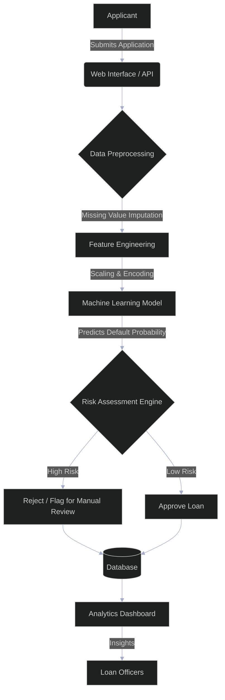

# 🚀 SuperLender: Smarter Loans with Data-Driven Decisions

Welcome to **SuperLender**! A cutting-edge, data-driven loan approval prediction system designed to empower financial institutions with smarter, faster, and more reliable lending decisions.

---

## 📖 Table of Contents
- [About the Project](#-about-the-project)
- [Certification & Recognition](#-certification--recognition)
- [Key Features](#-key-features)
- [Architecture & Flow](#-architecture--flow)
- [Tech Stack](#-tech-stack)
- [Getting Started](#-getting-started)
- [Usage](#-usage)
- [Contributing](#-contributing)
- [License](#-license)

---

## 💡 About the Project

SuperLender leverages advanced machine learning algorithms to analyze applicant data, assess credit risk, and automate loan decision-making processes. By utilizing historical financial data, SuperLender minimizes default rates, optimizes lending portfolios, and reduces the time required for manual reviews.

---

## 🏆 Certification & Recognition

This project's core predictive model was developed and evaluated as part of the **Zindi Loan Default Prediction Challenge**, demonstrating its capability to handle real-world financial datasets and predict loan defaults effectively.

<div align="center">
  
  <br/>
  <i>Certificate of Participation - Zindi Loan Default Prediction Challenge</i>
</div>

---

## ✨ Key Features

- **Automated Risk Assessment:** Evaluates loan applications in real-time using predictive modeling.
- **Data-Driven Insights:** Identifies key factors influencing loan defaults (e.g., credit history, income, debt-to-income ratio).
- **Scalable Architecture:** Designed to handle high volumes of loan applications efficiently.
- **Interactive Dashboard:** Visualizes applicant data and model predictions for loan officers.
- **Explainable AI (XAI):** Provides transparent reasoning behind every loan approval or rejection.

---

## 🏗️ Architecture & Flow

The following diagram illustrates the end-to-end flow of the SuperLender system, from application submission to the final decision.



---

## 🛠️ Tech Stack

- **Machine Learning:** Python, Scikit-Learn, XGBoost, Pandas, NumPy
- **Backend API:** FastAPI / Flask
- **Frontend:** React.js, Tailwind CSS
- **Database:** PostgreSQL
- **Deployment:** Docker, AWS / Google Cloud

---

## 🚀 Getting Started

Follow these instructions to get a copy of the project up and running on your local machine for development and testing purposes.

### Prerequisites

- Python 3.8+
- Node.js 16+
- PostgreSQL

### Installation

1. **Clone the repository**
   ```bash
   git clone https://github.com/Rupeshbhardwaj002/SuperLender-Smarter-Loans-with-Data-Driven-Decisions.git
   cd SuperLender-Smarter-Loans-with-Data-Driven-Decisions
   ```

2. **Set up the backend**
   ```bash
   cd backend
   python -m venv venv
   source venv/bin/activate  # On Windows use \`venv\Scripts\activate\`
   pip install -r requirements.txt
   uvicorn main:app --reload
   ```

3. **Set up the frontend**
   ```bash
   cd frontend
   npm install
   npm run dev
   ```

---

## 📈 Usage

1. Navigate to `http://localhost:3000` to access the SuperLender dashboard.
2. Submit a new loan application via the web interface.
3. The system will process the data and return a real-time risk assessment and decision.
4. Loan officers can review flagged applications and overall portfolio metrics in the analytics dashboard.

---

## 🤝 Contributing

Contributions are what make the open-source community such an amazing place to learn, inspire, and create. Any contributions you make are **greatly appreciated**.

1. Fork the Project
2. Create your Feature Branch (`git checkout -b feature/AmazingFeature`)
3. Commit your Changes (`git commit -m 'Add some AmazingFeature'`)
4. Push to the Branch (`git push origin feature/AmazingFeature`)
5. Open a Pull Request

---

## 📄 License

Distributed under the MIT License. See `LICENSE` for more information.

---
*Built with ❤️ by [Rupeshbhardwaj002](https://github.com/Rupeshbhardwaj002)*
